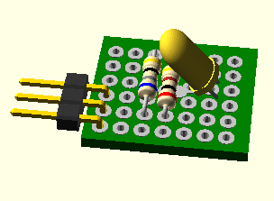
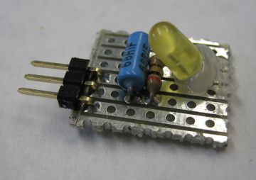
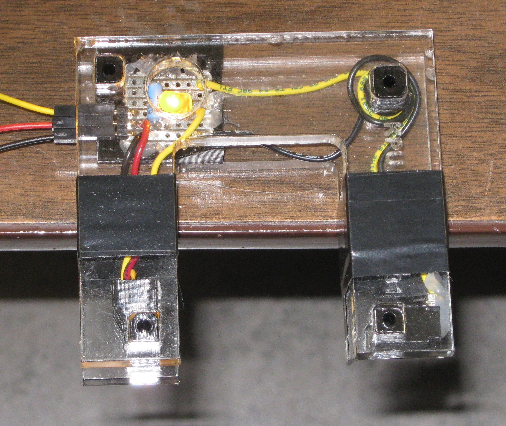
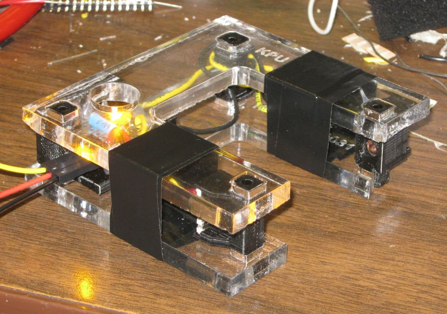

# junction-brd

As part of a photogate project I have created a junction board.

Note work is still needed on this solid object. 

* The leads on the LED need to be spread out to match the holes.
* I made a addition to the existing library adding a new board type as PERF20x17. 
  My actual perf board has traceses joining the holes in the x direction. I have not
  yet worked out the best method to add this.
* I will add the off board jumper wires.
  
 ... 

The actual board is in the top left of this photo.

Another view.

